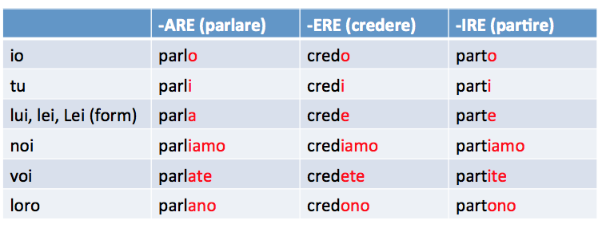

[Voltar](../../README.md)

# Duolingo - Unidade 01

## Artigos definidos e indefinidos

| Italiano | Português |
| --- | --- |
| il | o |
| la | a |
| un | um |
| una | uma |

* `!` l'uomo (correto) | il uomo (errado)
* `!` l'acqua (correto) | la acqua (errado)

## Comidas e bebidas

| Italiano | Português |
| --- | --- |
| acqua | água |
| mela | maça |
| pane | pão |

## Pronomes pessoais

| Italiano | Português |
| --- | --- |
| io | eu |
| tu | tu |
| lui/lei | ele/ela |
| noi | nós |
| voi | vós |
| loro | eles/elas |

## Verbo beber (bere) IRREGULAR

| Italiano | Português |
| --- | --- |
| bevo | bebo |
| bevi | bebe |
| beve | bebe |
| beviamo | bebemos |
| bevete | bebem |
| bevono | bebem |

## Verbo comer (mangiare) REGULAR

| Italiano | Português |
| --- | --- |
| mangio | como |
| mangi | come |
| mangia | come |
| mangiamo | comemos |
| mangiate | comem |
| mangiano | comem |

## Verbo ser (essere) IRREGULAR

* Em italiano, o verbo essere se comporta como o verbo 'to be' do inglês (é/está).
* Na realidade, o verbo 'stare' (estar) é utilizado em outras situações mais específicas.

| Italiano | Português |
| --- | --- |
| sono | sou |
| sei | é |
| è | é |
| siamo | somos |
| siete | são |
| sono | são |

## Vocabulário

| Italiano | Português |
| --- | --- |
| donna | mulher |
| uomo | homem |
| ragazzo/ragazza | menino/menina |

| Italiano | Português |
| --- | --- |
| buonanotte | boa noite |
| buonasera | boa noite |
| buongiorno | bom dia |
| arrivederci | tchau |
| ciao | oi/tchau |

| Italiano | Português |
| --- | --- |
| grazie | obrigado |
| per favore | por favor | 
| prego | de nada |
| grazie mille | muito obrigado |
| spiacente | sentido/pesaroso |

* io sono spiacente | eu sinto muito (não muito comum)

| Italiano | Português |
| --- | --- |
| non | não (como negação de verbo) |
| no | não |
| sì | sim |

## Verbos regulares

