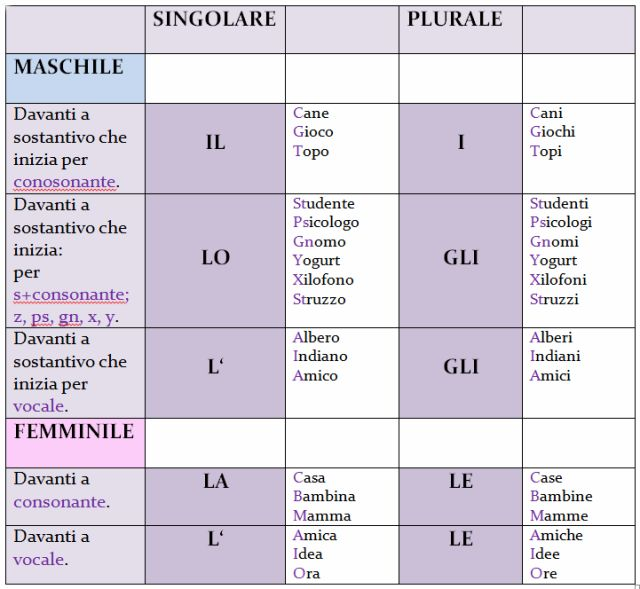
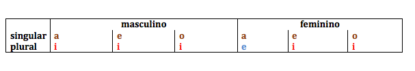
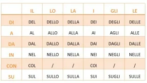

[Voltar](../../README.md)

# Duolingo - Unidade 02

## Artigos definidos (continuação)

## Plural

* Existem algumas exceções. Por exemplo: la città | le città

## Verbo escrever (scrivere)

| Italiano | Português |
| --- | --- |
| scrivo | escrevo |
| scrivi | escreve |
| scrive | escreve |
| scriviamo | escrevemos |
| scrivete | escrevem |
| scrivono | escrevem |

## Verbo ler (leggere)

| Italiano | Português |
| --- | --- |
| leggo | leio |
| leggi | lê |
| legge | lê |
| leggiamo | lemos |
| leggete | lêem |
| leggono | lêem |

## Verbo avere (ter)

| Italiano | Português |
| --- | --- |
| ho | tenho |
| hai | tem |
| ha | tem |
| abbiamo | temos |
| avete | tem |
| hanno | tem |

## Comidas e bebidas

| Italiano | Português |
| --- | --- |
| zucchero | açucar |

## Vocabulário

| Italiano | Português |
| --- | --- |
| giornale | jornal |
| libro | livro |

| Italiano | Português |
| --- | --- |
| uomini | homens |
| donne | mulheres |

## Preposições

