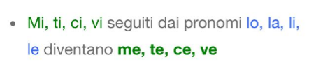

[Voltar](../../README.md)

# Duolingo - Unidade 02

## Artigos definidos (continuação)

## Plural

* Existem algumas exceções. Por exemplo: la città | le città

## Verbo escrever (scrivere) REGULAR

| Italiano | Português |
| --- | --- |
| scrivo | escrevo |
| scrivi | escreve |
| scrive | escreve |
| scriviamo | escrevemos |
| scrivete | escrevem |
| scrivono | escrevem |

## Verbo ler (leggere) REGULAR

| Italiano | Português |
| --- | --- |
| leggo | leio |
| leggi | lê |
| legge | lê |
| leggiamo | lemos |
| leggete | lêem |
| leggono | lêem |

## Verbo cozinhar (cucinare) REGULAR

| Italiano | Português |
| --- | --- |
| cucino | cozinho |
| cucini | cozinha |
| cucina | cozinha |
| cuciniamo | cozinhamos |
| cucinate | cozinham |
| cucinano | cozinham |

## Verbo ferver (bollire) REGULAR

| Italiano | Português |
| --- | --- |
| bollo | fervo |
| bolli | ferve |
| bolle | ferve |
| bolliamo | fervemos |
| bollite | fervem |
| bollono | fervem |

## Verbo cortar (tagliare) REGULAR

| Italiano | Português |
| --- | --- |
| taglio | corto |
| tagli | corta |
| taglia | corta |
| tagliamo | cortamos |
| tagliate | cortam |
| tagliano | cortam |

## Verbo ter (avere) IRREGULAR

| Italiano | Português |
| --- | --- |
| ho | tenho |
| hai | tem |
| ha | tem |
| abbiamo | temos |
| avete | tem |
| hanno | tem |

## Comidas e bebidas

| Italiano | Português |
| --- | --- |
| zucchero | açucar |
| caffè | café |
| biscotto | biscoito |
| cioccolato | chocolate |
| latte | leite |
| gelato | sorvete |
| crema | creme |
| banana | banana |
| frutta | fruta |
| cibo | comida |
| carota | cenoura |
| caramella | bala |
| fagiolo | feijão |
| torta | bolo |
| birra | cerveja |
| burro | manteiga |
| manzo | carne bovina |
| formaggio | queijo |
| pesce | peixe |
| uovo | ovo |
| pollo | frango |
| bevanda | bebida |
| uva | uva/uvas |
| aglio | alho |
| fritto (un uovo fritto) | frito |

* gelato al cioccolato | sorvete DE chocolate

| Italiano | Português |
| --- | --- |
| colazione | café da manhã |
| cena | jantar |
| cuoco | cozinheiro |

## Vocabulário

| Italiano | Português |
| --- | --- |
| giornale | jornal |
| libro | livro |

| Italiano | Português |
| --- | --- |
| tazza | xícara |
| piatto | prato |
| ciotola | tigela |
| bottiglia | garrafa |
| forchetta | garfo |
| bicchiere | copo |

| Italiano | Português |
| --- | --- |
| uomini | homens |
| donne | mulheres |

## Preposições

## Pronomes oblíquos

